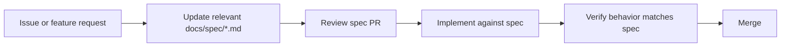

# botinho.ai Documentation

This folder contains the **as-is specification** of the botinho.ai codebase and the **spec-driven development workflow** for future changes.

## Quick start

- **As-is spec index:** [spec/00-index.md](spec/00-index.md)
- **Remaining roadmap:** [spec/future/00-roadmap.md](spec/future/00-roadmap.md)
- **Architecture decisions:** [adr/README.md](adr/README.md)

## Current stack (summary)

| Layer | Technology |
|-------|------------|
| Framework | Next.js 15, React 19, TypeScript |
| Database | Cloud Firestore |
| Auth | Firebase Auth + NextAuth JWT bridge |
| AI | Gemini via Firebase AI Logic |
| Billing | Stripe |
| Messaging / email | **Not connected** — provider TBD |

## Spec-driven development workflow



### Rules

1. **No feature work without a spec touch** — even bug fixes update the relevant spec section if behavior changes.
2. **Spec PRs can merge independently** — spec and implementation can be separate PRs, but spec comes first for new features.
3. **Status tags** — every feature entry uses one of: `implemented` | `partial` | `stub` | `legacy`.
4. **Source links** — every behavior claim links to a file path in the repository.
5. **Gap registry** — new gaps discovered during development go into [spec/18-known-gaps-and-legacy.md](spec/18-known-gaps-and-legacy.md).
6. **ADR for decisions** — architectural choices that change direction get a short ADR in [adr/](adr/).

### PR checklist

Before merging a feature or behavior change:

- [ ] Relevant spec file updated
- [ ] Status tags accurate
- [ ] New env vars added to [spec/16-environment-and-config.md](spec/16-environment-and-config.md)
- [ ] New server actions documented in [spec/07-server-actions.md](spec/07-server-actions.md)
- [ ] Gaps file updated if incomplete behavior shipped intentionally

## Spec file template

Each file under `spec/` follows this structure:

1. **Purpose** — what this module covers
2. **Status** — overall implementation status
3. **Source of truth** — linked files
4. **Behavior** — rules, flows, acceptance criteria (as-is)
5. **Data contracts** — types, Zod schemas, DB fields
6. **Edge cases and errors** — known failure modes
7. **Open questions** — only if blocking (minimal for as-is docs)

## Folder layout

```
docs/
├── README.md                 # This file
├── spec/
│   ├── 00-index.md           # As-is master index
│   ├── 01–18                 # As-is domain specs
│   └── future/               # Roadmap and completed migration records
│       ├── 00-roadmap.md
│       ├── 01-firebase-platform.md   (completed)
│       ├── 02-gemini-ai.md           (completed)
│       └── 03-messaging-and-email.md (open)
└── adr/
    ├── README.md             # ADR template + index
    └── 0001-firebase-google-stack.md
```
