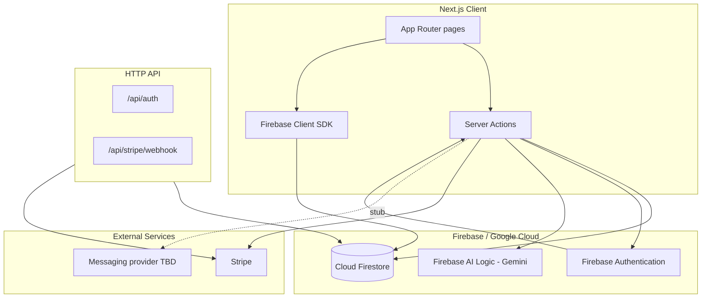

# botinho.ai Specification Index

**Last updated:** 2026-06-19 — reflects current Firebase + Gemini stack  
**Scope:** Document current behavior only (including gaps and legacy code)

> **Remaining roadmap:** Messaging provider and production email → [future/00-roadmap.md](future/00-roadmap.md)

## Glossary

| Term | Definition |
|------|------------|
| **Company** | Multi-tenant organization; all business data is scoped by `companyId` (Firestore doc id) |
| **Server action** | Next.js `"use server"` function in `components/server-actions/`; primary mutation API |
| **Firebase Auth** | Identity provider (email/password, Google); uid is the primary user key |
| **NextAuth session** | JWT cookie bridge over Firebase Auth for App Router session management |
| **Messaging provider** | External API for WhatsApp + transactional email — **not chosen yet** |

## Status legend

| Tag | Meaning |
|-----|---------|
| `implemented` | Works end-to-end in production path |
| `partial` | UI or backend exists but incomplete or has known gaps |
| `stub` | Placeholder UI or logic; not wired to real data/services |
| `legacy` | Leftover from prior product (Opineeo survey SaaS) |

## Spec modules

| # | Document | Status | Summary |
|---|----------|--------|---------|
| 01 | [Product overview](01-product-overview.md) | — | Vision, personas, feature matrix |
| 02 | [Architecture](02-architecture.md) | `implemented` | Firebase, Next.js, Gemini, Stripe |
| 03 | [Routing and pages](03-routing-and-pages.md) | `implemented` | All routes, middleware, layouts |
| 04 | [Authentication](04-authentication.md) | `implemented` | Firebase Auth + NextAuth JWT |
| 05 | [Authorization](05-authorization.md) | `implemented` | Company roles, Firestore guards |
| 06 | [Data model](06-data-model.md) | `implemented` | Firestore collections and types |
| 07 | [Server actions](07-server-actions.md) | `implemented` | Full action catalog by domain |
| 08 | [API routes](08-api-routes.md) | `implemented` | HTTP endpoints and webhooks |
| 09 | [WhatsApp integration](09-whatsapp-integration.md) | `stub` | No provider connected yet |
| 10 | [AI training](10-ai-training.md) | `implemented` | Firestore CRUD + Gemini inference |
| 11 | [Inbox and messaging](11-inbox-and-messaging.md) | `partial` | Firestore CRUD + realtime; no outbound/inbound provider |
| 12 | [Subscription and billing](12-subscription-and-billing.md) | `implemented` | Stripe + Firestore subscriptions |
| 13 | [Email system](13-email-system.md) | `stub` | Dev console fallback; provider TBD |
| 14 | [i18n](14-i18n.md) | `implemented` | Locales, routing, messages |
| 15 | [UI and design system](15-ui-and-design-system.md) | `implemented` | shadcn, Tailwind, components |
| 16 | [Environment and config](16-environment-and-config.md) | — | Env vars, config files |
| 17 | [Deployment and ops](17-deployment-and-ops.md) | `partial` | Vercel; no CI/tests |
| 18 | [Known gaps and legacy](18-known-gaps-and-legacy.md) | — | Technical debt inventory |

## Roadmap specs (not yet implemented)

| Document | Status | Summary |
|----------|--------|---------|
| [future/00-roadmap.md](future/00-roadmap.md) | `open` | Remaining work: messaging + production email |
| [future/03-messaging-and-email.md](future/03-messaging-and-email.md) | `open` | Provider selection criteria and integration plan |

Completed migrations (archived for reference):

| Document | Status |
|----------|--------|
| [future/01-firebase-platform.md](future/01-firebase-platform.md) | `completed` |
| [future/02-gemini-ai.md](future/02-gemini-ai.md) | `completed` |

ADR: [0001-firebase-google-stack.md](../adr/0001-firebase-google-stack.md) (accepted, updated)

## Related documentation (outside `docs/spec/`)

| File | Purpose |
|------|---------|
| [readme.md](../../readme.md) | Project overview and setup |
| [STRIPE_SETUP.md](../../STRIPE_SETUP.md) | Stripe products, webhooks, test cards |
| [docs/archive/PERIODIC_USAGE_MIGRATION.md](../archive/PERIODIC_USAGE_MIGRATION.md) | Historical Opineeo usage migration (archived) |

## System context (high level)

