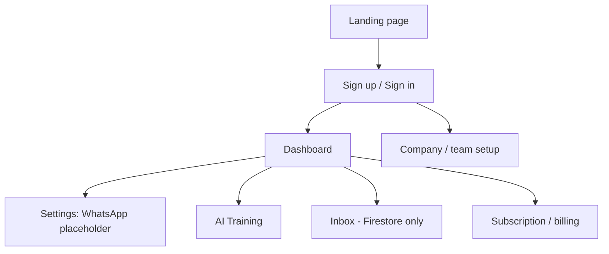

# 01 — Product Overview

## Purpose

Describe what botinho.ai is, who it serves, and the current feature inventory with implementation status.

## Status

`partial` — Core SaaS flows work on Firebase; WhatsApp delivery and production email are not connected.

## Source of truth

- [readme.md](../../readme.md)
- [app/[locale]/page.tsx](../../app/[locale]/page.tsx) — landing page
- Feature pages under [app/[locale]/](../../app/[locale]/)

## Product vision

**botinho.ai** is a WhatsApp AI automation platform for small and medium businesses (restaurants, shops, service providers). It helps businesses:

- Connect WhatsApp Business accounts *(not yet wired)*
- Train an AI assistant on business-specific knowledge
- Manage customer conversations in a unified inbox
- Collaborate as a team with role-based access
- Subscribe to tiered plans with usage limits

Tagline: *"Your friendly WhatsApp assistant — powered by AI."*

## Personas

| Persona | Goals |
|---------|-------|
| **Business owner** | Connect WhatsApp, configure AI, monitor inbox and analytics |
| **Team agent** | Reply to customers, use AI suggestions and templates |
| **Company admin** | Invite members, manage subscription, configure settings |

## Core user journeys (as-is)

1. **Acquisition** — User visits landing, views pricing, clicks sign-up.
2. **Registration** — Email/password or Google OAuth; OTP flow when `OTP_ENABLED=TRUE`.
3. **Onboarding** — Default company and FREE subscription created; paid plan from URL param triggers Stripe checkout.
4. **WhatsApp connect** — Settings shows placeholder; no provider connected.
5. **AI training** — Add knowledge items (with URL summarization), quick answers, templates.
6. **Operations** — Inbox for conversations (internal CRM); dashboard for KPIs; customer page for CRM (stub).
7. **Billing** — Subscription page for plan view, Stripe checkout/portal.

## Feature matrix

| Feature | Route | Status | Notes |
|---------|-------|--------|-------|
| Landing / marketing | `/[locale]/` | `implemented` | Hero, features, pricing, FAQ, contact |
| Sign in | `/[locale]/sign-in` | `implemented` | Firebase Auth + Google |
| Sign up | `/[locale]/sign-up` | `implemented` | OTP optional |
| Email confirm | `/[locale]/sign-up/confirm` | `implemented` | Token-based |
| OTP verify | `/[locale]/sign-up/otp` | `implemented` | When OTP enabled |
| Password reset | `/[locale]/reset-password` | `implemented` | Firebase reset link |
| Dashboard | `/[locale]/dashboard` | `partial` | KPI cards and charts |
| Inbox | `/[locale]/inbox` | `partial` | Firestore + realtime; no WhatsApp delivery |
| Customers | `/[locale]/customer` | `stub` | Mock local state only |
| AI training | `/[locale]/ai-training` | `implemented` | Firestore CRUD + Gemini |
| Company / team | `/[locale]/company` | `implemented` | Members, invites, roles |
| Settings | `/[locale]/settings` | `partial` | Auto-reply toggles; WhatsApp placeholder |
| Account | `/[locale]/account` | `implemented` | Profile, theme, language |
| Subscription | `/[locale]/subscription` | `implemented` | Stripe checkout and portal |
| Support | `/[locale]/support` | `implemented` | Contact form → email stub |

## Non-functional characteristics (as-is)

| Area | Current state |
|------|---------------|
| i18n | English and Brazilian Portuguese |
| Auth | Firebase Auth + NextAuth JWT, 30 days |
| Database | Cloud Firestore |
| AI | Gemini via Firebase AI Logic |
| Multi-tenancy | Company-scoped data |
| Deployment | Firebase App Hosting (or self-hosted Node) |
| Tests | None |
| CI/CD | None in repo |

## Edge cases

- Authenticated users hitting sign-in/sign-up are redirected to `/dashboard`.
- Pending paid subscription after sign-up redirects to Stripe checkout via `UserProvider`.
- OTP codes logged to server console in development.

## Open questions

- Messaging and email provider selection — see [future/03-messaging-and-email.md](future/03-messaging-and-email.md).
