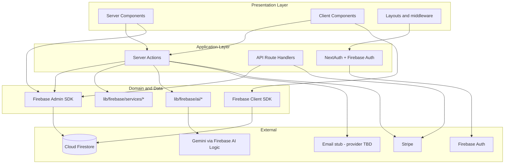
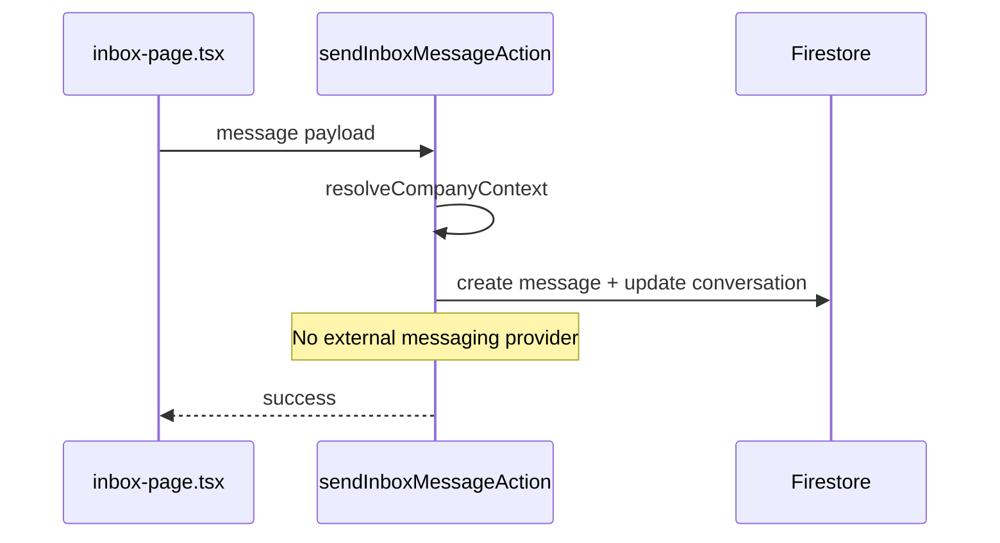
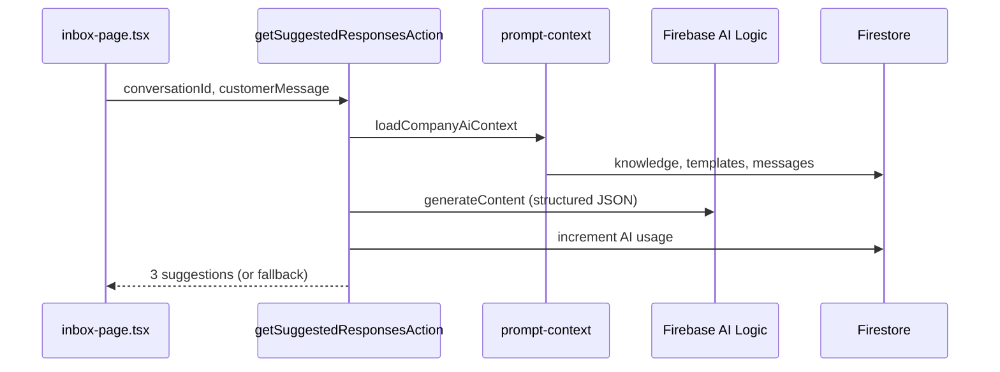

# 02 — Architecture

## Purpose

Describe system layers, major components, and how data flows between the Next.js app, Firebase, and external services.

## Status

`implemented` — Firebase + Gemini stack is in production code. Messaging provider is not integrated.

## Source of truth

- [package.json](../../package.json)
- [next.config.mjs](../../next.config.mjs)
- [lib/firebase/](../../lib/firebase/)
- [components/server-actions/](../../components/server-actions/)
- [middleware.ts](../../middleware.ts)

## Stack summary

| Layer | Technology |
|-------|------------|
| Framework | Next.js 15.5 (App Router, Turbopack dev) |
| UI | React 19, TypeScript 5, Tailwind CSS 4, shadcn/ui |
| Database | Cloud Firestore via Firebase Admin SDK (server) + Client SDK (realtime) |
| Auth | Firebase Authentication + NextAuth v5 (JWT bridge) |
| AI | Firebase AI Logic (Gemini 2.0 flash / pro) |
| Payments | Stripe |
| Email | Stub in `lib/email/` — provider TBD |
| i18n | next-intl |
| Deployment | Firebase App Hosting (or self-hosted Node) |

## Layer diagram

## Architectural decisions (as-is)

### Server actions as primary API

Most mutations and queries go through **server actions** in `components/server-actions/`. Only three HTTP routes exist under `app/api/`.

**Rationale:** Colocation with UI, type-safe calls from client components, Next.js-native pattern.

### Company-scoped multi-tenancy

All business data lives under `companies/{companyId}/…` subcollections or references `companyId`. Users access data through `members/{uid}` membership docs. The active company comes from `users/{uid}.defaultCompanyId` or the first accepted membership.

Guards: [`resolveCompanyContext`](../../components/server-actions/utils.ts) in server actions.

### Firebase Auth + NextAuth JWT bridge

- **Firebase Auth** is the identity source (email/password, Google OAuth)
- **NextAuth v5** issues JWT session cookies for middleware and server session reads
- Credentials sign-in calls Firebase Identity Toolkit REST API, then loads Firestore user profile
- OTP sign-in uses a dedicated `otp-session` credentials provider after Firebase user is activated

### Firestore for all application data

Prisma and PostgreSQL were removed. All CRUD uses Firebase Admin SDK in server actions and Firebase Client SDK for realtime inbox listeners.

### Gemini inference (server-only)

AI features use Firebase AI Logic via [`lib/firebase/ai/server-ai.ts`](../../lib/firebase/ai/server-ai.ts):

| Use case | Model |
|----------|-------|
| Inbox suggestions | `gemini-2.0-flash` |
| Auto-reply text generation | `gemini-2.0-pro` |
| URL knowledge summarization | `gemini-2.0-flash` |

Usage is metered per company in `companies/{id}/usage/{YYYY-MM}`.

### Messaging not integrated

WhatsApp and transactional email have **no production provider**. Inbox messages are stored in Firestore only. Email sends log to console in development.

### Build configuration

[`next.config.mjs`](../../next.config.mjs):

- Plugins: `next-intl`
- `eslint.ignoreDuringBuilds: true`
- `typescript.ignoreBuildErrors: true`
- `images.unoptimized: true`

## Key directories

| Path | Role |
|------|------|
| `app/` | Routes, layouts, API handlers, auth config |
| `components/` | UI, feature pages, server actions |
| `lib/firebase/` | Admin/client SDK, services, AI, auth flows |
| `lib/email/` | Transactional email stub and message builders |
| `hooks/` | Shared React hooks (e.g. inbox realtime) |
| `i18n/` | Locale routing and message catalogs |

## Data flow: send inbox message

## Data flow: AI suggested responses

## Edge cases

- API routes (`/api/*`) skip page middleware auth; each route implements its own auth (Stripe signature, bearer tokens).
- If Firebase AI is not configured (`NEXT_PUBLIC_FIREBASE_API_KEY` missing), suggestions fall back to hardcoded strings.
- Firestore security rules are not yet enforced client-side for inbox listeners — relies on authenticated app shell.

## Open questions

- Which messaging provider will handle WhatsApp + email? See [future/03-messaging-and-email.md](future/03-messaging-and-email.md).
