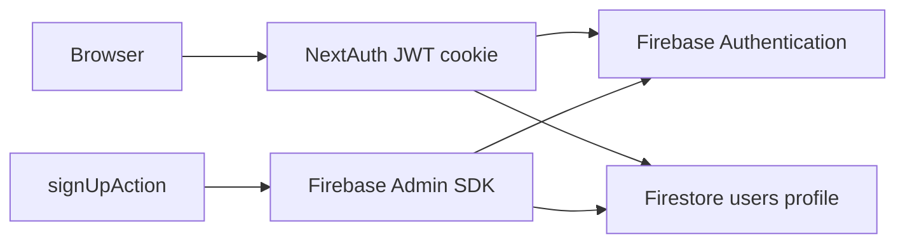

# 04 — Authentication

## Purpose

Document user authentication providers, session handling, and auth-related user flows.

## Status

`implemented` — Firebase Auth is the identity source; NextAuth provides JWT session cookies.

## Source of truth

- [app/auth.ts](../../app/auth.ts)
- [app/api/auth/[...nextauth]/route.ts](../../app/api/auth/[...nextauth]/route.ts)
- [components/server-actions/auth.ts](../../components/server-actions/auth.ts)
- [lib/firebase/auth/signup-flow.ts](../../lib/firebase/auth/signup-flow.ts)
- [lib/auth/server-session.ts](../../lib/auth/server-session.ts)
- [middleware.ts](../../middleware.ts)

## Architecture



## NextAuth configuration

| Setting | Value |
|---------|-------|
| Secret | `AUTH_SECRET` env var |
| Session strategy | JWT |
| Session max age | 30 days |
| Custom sign-in page | `/sign-in` |
| Session cookie | `next-auth.session-token` (httpOnly, sameSite: lax) |

## Providers

### 1. Google OAuth

- Env: `AUTH_GOOGLE_ID`, `AUTH_GOOGLE_SECRET`
- On first sign-in: `ensureGoogleUserProvisioned` creates Firestore profile, company, subscription, welcome email (stub)
- Sets `oauth_redirect` cookie when redirect path provided
- Post-login handled at `/auth/post-login`

### 2. Credentials (email/password)

- Validates via Firebase Identity Toolkit REST API (`signInWithPassword`)
- Loads Firestore user profile via `getUserProfile`
- Rejects disabled Firebase users (`USER_DISABLED` → account-blocked)
- Custom errors: `invalid-credentials`, `account-blocked`

### 3. OTP session (`id: "otp-session"`)

- Used after OTP verification in sign-up flow
- Authorizes by uid + email match against Firebase Auth user
- Creates NextAuth session without re-entering password

## JWT session payload

| Field | Source |
|-------|--------|
| `id` | Firebase uid (string) |
| `email` | User email |
| `name` | firstName + lastName |
| `language` | `pt_BR` → `pt-BR` |
| `avatarUrl` | Firestore profile |
| `defaultCompanyId` | Firestore user doc |

Server session also exposes `uid` via [lib/auth/server-session.ts](../../lib/auth/server-session.ts).

## Sign-up flow

```mermaid
flowchart TD
  Form[Sign up form] --> Validate[Zod validation]
  Validate --> OTPCheck{OTP_ENABLED?}
  OTPCheck -->|Yes| CreateOTP[Create Firebase user disabled + pendingSignups doc + OTP email]
  OTPCheck -->|No| CreateEmail[Create Firebase user + confirmation link email]
  CreateOTP --> OTPPage[/sign-up/otp]
  CreateEmail --> CheckEmail[/sign-up/check-email]
  OTPPage --> ConfirmOTP[confirmOTPAction → otp-session sign-in]
  CheckEmail --> ConfirmToken[/sign-up/confirm?token=]
  ConfirmOTP --> Provision[createUserProfile + createCompanyForUser]
  ConfirmToken --> Provision
  Provision --> Dashboard[Dashboard or Stripe checkout]
```

### Sign-up side effects (after OTP/email confirm)

1. Firestore `users/{uid}` profile created
2. Default `companies/{id}` with owner membership
3. FREE subscription via `createFreeSubscriptionForCompany`
4. `pendingSignups` marked verified

Plan selection: `?plan=` URL param; paid plans may set subscription to `pending` and redirect to Stripe.

## Sign-in flow

1. Client submits credentials via `signInAction`
2. NextAuth credentials provider validates against Firebase Auth
3. JWT session cookie set
4. `validateUserCompanyAndSubscription` ensures company + subscription exist
5. If pending paid subscription → redirect to Stripe checkout
6. Otherwise → dashboard or redirect target

## Password reset flow

1. `resetPasswordAction(email)` — generates Firebase password reset link via Admin SDK
2. Sends link via transactional email stub ([lib/email/send-transactional-email.ts](../../lib/email/send-transactional-email.ts))
3. User opens Firebase-hosted reset flow → `/reset-password/confirm`

Note: `confirmPasswordResetAction` returns a message directing users to the email link (Firebase handles password update).

## Email / OTP confirmation

- OTP path: 6-digit code hashed in `pendingSignups/{uid}`; verified by `confirmOTPAction`
- Email link path: token hashed in `pendingSignups`; verified by `confirmEmailAction`
- Company invite: same confirm page with `companyId` param → `acceptCompanyInvite`

## Middleware integration

- Middleware checks NextAuth session cookie presence only (Edge-safe; no Firestore lookup)
- Unauthenticated access to protected pages → sign-in with redirect param
- Authenticated access to sign-in/sign-up → dashboard redirect
- `/sign-up/confirm` always allowed (token-based)

## Data contracts

### Sign-in schema

- `email`: valid email
- `password`: min 6 characters

### Sign-up schema

- `name`, `email`, `phone?`, `password`, `confirmPassword`

## Edge cases

- Google sign-in auto-provisions tenant on first login.
- OTP and email confirmation paths are mutually exclusive based on `OTP_ENABLED`.
- Firebase user is created at sign-up (may be `disabled` until OTP verified).
- `getCurrentUserAction` loads profile from Firestore for `UserProvider`.

## Open questions

None for as-is documentation.
