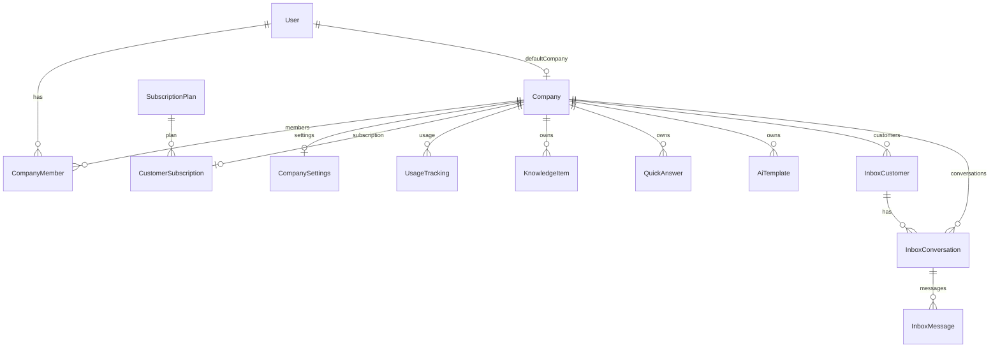

# 06 — Data Model

## Purpose

Full reference for the Cloud Firestore schema, including collections, subcollections, types, and relationships.

## Status

`implemented`

## Source of truth

- [lib/firebase/collections.ts](../../lib/firebase/collections.ts)
- [lib/firebase/types.ts](../../lib/firebase/types.ts)
- [lib/firebase/services/](../../lib/firebase/services/)

## ER diagram

## Top-level collections

| Collection | Doc id | Purpose |
|------------|--------|---------|
| `users` | Firebase Auth `uid` | User profile |
| `companies` | Auto-generated | Tenant root |
| `plans` | Plan slug (`free`, `starter`, …) | Subscription plan definitions (also hardcoded in service) |
| `pendingSignups` | Firebase Auth `uid` | OTP/confirmation state during sign-up |

## Company subcollections

Path prefix: `companies/{companyId}/`

| Subcollection | Doc id | Purpose |
|---------------|--------|---------|
| `members` | User `uid` | Membership and roles |
| `settings` | `default` | Notification and auto-reply flags |
| `knowledge` | Auto | AI knowledge items |
| `quickAnswers` | Auto | Canned Q/A pairs |
| `templates` | Auto | Message templates (options embedded) |
| `surveys` | Auto | Customer surveys |
| `surveyResponses` | Auto | Survey response records |
| `campaigns` | Auto | Outbound message campaigns |
| `campaignDeliveries` | Auto | Per-recipient campaign send tracking |
| `customers` | Auto | Inbox CRM customers |
| `conversations` | Auto | Inbox threads |
| `subscription` | `current` | Active Stripe subscription |
| `usage` | `YYYY-MM` | Monthly usage counters |
| `scheduleServices` | Auto | Bookable services |
| `agendaProfiles` | Member `uid` | Per-member agenda settings |
| `scheduleBlocks` | Auto | Blocked/unavailable time |
| `scheduleReservations` | Auto | Appointments |
| `scheduleCounters` | `_company` | Reservation number sequence |

Settings doc: `companies/{companyId}/settings/schedule` — company scheduling rules.

See [28-schedule-reservations.md](28-schedule-reservations.md).

Message subcollection: `companies/{companyId}/conversations/{conversationId}/messages/{messageId}`

## Document schemas

### User (`users/{uid}`)

| Field | Type | Notes |
|-------|------|-------|
| uid | string | Same as doc id |
| email | string | |
| firstName | string | |
| lastName | string? | |
| phone | string? | |
| language | `en` \| `pt_BR` | |
| theme | `light` \| `dark` \| `system` | |
| defaultCompanyId | string? | Firestore company doc id |
| avatarUrl | string? | |
| createdAt, updatedAt | Timestamp | |

### Company (`companies/{companyId}`)

| Field | Type | Notes |
|-------|------|-------|
| slug | string | Unique, URL-safe |
| name | string | |
| description | string? | |
| tokenApi | string? | External API token (bcrypt hash) |
| createdAt, updatedAt | Timestamp | |

### CompanyMember (`companies/{id}/members/{uid}`)

| Field | Type | Notes |
|-------|------|-------|
| uid | string | |
| isOwner | boolean | |
| isAdmin | boolean | |
| canPost | boolean | |
| canApprove | boolean | |
| canManageAgenda | boolean | Schedule/agenda management |
| status | `invited` \| `accepted` \| `rejected` | |
| email | string? | Invite placeholder users |
| inviteToken | string? | Cleared on accept |
| createdAt, updatedAt | Timestamp | |

See [19-company-and-members.md](19-company-and-members.md) for invite rules and single-company policy.

### CompanySettings (`companies/{id}/settings/default`)

| Field | Type | Default |
|-------|------|---------|
| emailNotifications | boolean | true |
| newMessageAlerts | boolean | true |
| dailyReports | boolean | false |
| autoReply | boolean | true |
| smsFallbackEnabled | boolean | false (no provider yet) |

### KnowledgeItem (`companies/{id}/knowledge/{id}`)

| Field | Type |
|-------|------|
| type | `TEXT` \| `URL` |
| title, content | string |
| urlSummary | string? (populated on create/update for URL type via Gemini) |
| createdById | string? |
| createdAt, updatedAt | Timestamp |

### QuickAnswer, AiTemplate

QuickAnswer: `title`, `content`, timestamps.

AiTemplate: `name`, `content`, `category` (enum), `options[]` embedded `{ label, value }`.

### InboxCustomer

| Field | Type |
|-------|------|
| name | string |
| phone, email, address, notes | string? |
| createdAt, updatedAt | Timestamp |

Unique by phone per company (enforced in service layer).

### InboxConversation

| Field | Type |
|-------|------|
| customerId | string |
| subject | string? |
| lastMessagePreview | string? |
| lastMessageSentAt | Timestamp? |
| unreadCount | number |
| priority | low \| medium \| high |
| satisfactionScore | number? |
| tags | string[] |
| assignedToId | string? |
| activeSurveyResponseId | string? | Inline survey state |
| isArchived | boolean |
| archivedAt | Timestamp? |

### InboxMessage

| Field | Type |
|-------|------|
| senderType | customer \| agent \| bot \| system |
| senderUserId | string? |
| content | string |
| attachments | unknown? |
| status | pending \| sent \| delivered \| read \| failed |
| sentAt, createdAt, updatedAt | Timestamp |

### PendingSignup (`pendingSignups/{uid}`)

| Field | Type |
|-------|------|
| email, firstName, lastName?, phone? | |
| otpHash | string (bcrypt) |
| otpExpiresAt | Timestamp |
| planType | string? |
| language | UserLanguage |
| verified | boolean |
| createdAt | Timestamp |

### Subscription (`companies/{id}/subscription/current`)

Managed by [subscription-service.ts](../../lib/firebase/services/subscription-service.ts). Links to Stripe customer/subscription IDs, plan type, billing interval, period dates, status enum.

### Usage (`companies/{id}/usage/{YYYY-MM}`)

| Field | Type |
|-------|------|
| periodId | string |
| AI_RESPONSES | number (incremented by Gemini calls) |
| updatedAt | Timestamp |

## Enums

Defined in [lib/types/enums.ts](../../lib/types/enums.ts):

| Enum | Values |
|------|--------|
| PlanType | FREE, STARTER, PRO, BUSINESS, ENTERPRISE |
| BillingInterval | monthly, yearly |
| SubscriptionStatus | pending, active, canceled, past_due, trialing, incomplete, … |
| KnowledgeItemType | TEXT, URL |
| AiTemplateCategory | greeting, orders, products, support, closing |
| InboxMessageSenderType | customer, agent, bot, system |
| InboxMessageStatus | pending, sent, delivered, read, failed |
| InboxConversationPriority | low, medium, high |

## Removed (legacy Prisma models)

The following no longer exist in the codebase:

- Prisma `User`, `Account`, `Session`, `VerificationToken`
- `Worker`, `SessionAssignment` (WhatsApp controller era)
- `File`, `KvBackup`
- Survey models (`Survey`, etc.)

## Slug generation

Companies get unique slugs via [lib/firebase/slug.ts](../../lib/firebase/slug.ts) — lowercase, hyphenated, collision suffix.

## Edge cases

- Company and user ids are Firestore strings (not integers).
- `pendingSignups` doc is keyed by Firebase Auth uid created at sign-up (user may be `disabled` until OTP verified).
- Inbox customer phone uniqueness is query-based, not a Firestore composite index constraint.
- Subscription plans are defined in code (`PLAN_DEFINITIONS`) and optionally synced to `plans` collection.

## Open questions

None for as-is documentation.
