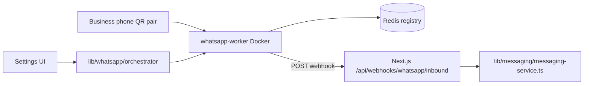

# 09 — WhatsApp Integration

## Purpose

Document WhatsApp connectivity, session management, and message delivery via the linked-device (whatsmeow) worker.

## Status

`partial` — Go worker + Redis orchestrator + QR pairing are implemented. Linked-device sessions can drop and require re-pair; see [23-whatsapp-inbound-reliability.md](23-whatsapp-inbound-reliability.md).

## Source of truth

- [services/whatsapp-worker/](../../services/whatsapp-worker/) — whatsmeow client pool
- [lib/whatsapp/orchestrator.ts](../../lib/whatsapp/orchestrator.ts) — session lifecycle, worker routing
- [components/settings/settings-page.tsx](../../components/settings/settings-page.tsx) — QR pairing UI
- [components/server-actions/whatsapp.ts](../../components/server-actions/whatsapp.ts)
- [app/api/webhooks/whatsapp/inbound/route.ts](../../app/api/webhooks/whatsapp/inbound/route.ts)

## Architecture

## Current state

| Capability | Status |
|------------|--------|
| WhatsApp linked-device connection | Implemented (whatsmeow) |
| QR pairing | Settings → WhatsAppPairingDialog |
| Session registry | Redis + Firestore `sessions` |
| Outbound message delivery | `sendOutbound` → worker `SendText` |
| Inbound message webhooks | Worker → `POST /api/webhooks/whatsapp/inbound` |
| Auto-reply delivery | Gemini + `sendOutbound` when agent enabled |
| Live session status in UI | `orchestrator.enrichAndPersist` (worker truth) |

## Session states

| Status | Meaning |
|--------|---------|
| `pending` | Session created, not yet connecting |
| `qr_pending` | Waiting for QR scan |
| `connected` | Linked and receiving messages |
| `disconnected` | Websocket dropped; reconnect attempted |
| `needs_qr` | Credentials invalid; user must re-pair |

## Settings UI

- List connected numbers with live status from worker
- Add number → QR pairing dialog
- Re-pair banner when session is `qr_pending` / `needs_qr` / `disconnected`
- Disconnect removes session from worker + Firestore

## Inbound flow

1. Customer sends WhatsApp message to business number
2. Worker `pool.handleEvent` → `OnMessage` callback
3. Worker POSTs webhook to Next.js (retries ×3)
4. `processInboundFromWebhook` → inbox message + optional auto-reply

## Outbound flow

1. Agent sends from inbox or auto-reply runs
2. `sendOutbound` → `WhatsAppOrchestrator.sendMessage`
3. Worker `SendText` (requires `IsLoggedIn()`)

## Environment

| Variable | Purpose |
|----------|---------|
| `WHATSAPP_WORKER_URL` | Worker HTTP base (dev: `http://localhost:8081`) |
| `WHATSAPP_WEBHOOK_SECRET` | Webhook auth token |
| `WEBHOOK_APP_URL` | Worker → Next.js URL (Docker: `http://host.docker.internal:3000`) |
| `REDIS_URL` | Session/worker registry |

Local dev: `npm run dev:infra` starts Redis + worker via [docker-compose.dev.yml](../../docker-compose.dev.yml).

## Known limitations

- Linked-device (not Meta Cloud API) — sessions can unlink on websocket EOF
- Group messages are skipped
- Media inbound stored as placeholders (`[Image]`, etc.)
- Worker must be running and session `connected` for inbound

## Related specs

- [11-inbox-and-messaging.md](11-inbox-and-messaging.md)
- [23-whatsapp-inbound-reliability.md](23-whatsapp-inbound-reliability.md)
- [24-whatsapp-session-store-persistence.md](24-whatsapp-session-store-persistence.md)
