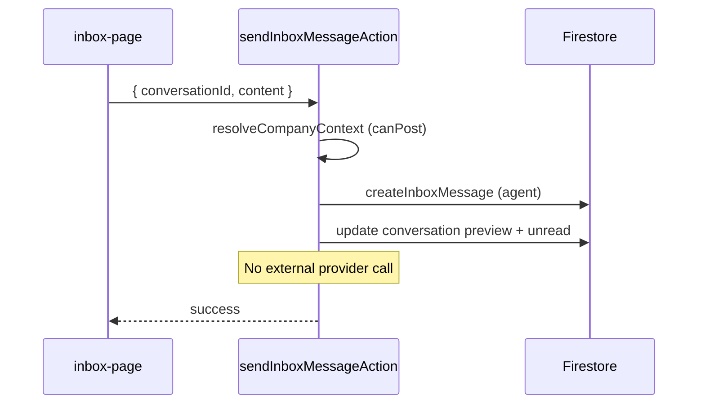

# 11 — Inbox and Messaging

## Purpose

Document conversation management, message lifecycle, real-time updates, and agent tooling in the inbox.

## Status

`partial` — Firestore CRUD and realtime listeners work; no external message delivery or inbound webhooks.

## Source of truth

- [components/inbox/inbox-page.tsx](../../components/inbox/inbox-page.tsx)
- [components/server-actions/inbox.ts](../../components/server-actions/inbox.ts)
- [lib/firebase/services/inbox-service.ts](../../lib/firebase/services/inbox-service.ts)
- [hooks/use-inbox-realtime.ts](../../hooks/use-inbox-realtime.ts)

## Data model hierarchy

```
InboxCustomer (1) ──→ (N) InboxConversation ──→ (N) InboxMessage
```

All records scoped under `companies/{companyId}/`.

## UI features (inbox-page.tsx)

| Feature | Implementation |
|---------|----------------|
| Conversation list | `getInboxConversationsAction` |
| Conversation detail + messages | `getInboxConversationDetailAction` |
| Send message | `sendInboxMessageAction` |
| Mark read | `markInboxConversationReadAction` |
| Update metadata | `updateInboxConversationMetadataAction` |
| AI suggestions | `getSuggestedResponsesAction` (Gemini) |
| Live agent panel | [context-panel.tsx](../../components/inbox/context-panel.tsx) — assignment, surveys |
| Real-time updates | Firestore `onSnapshot` via `useInboxRealtime` |

## Conversation fields

| Field | Purpose |
|-------|---------|
| subject | Optional thread title |
| lastMessagePreview | List display |
| lastMessageSentAt | Sort key |
| unreadCount | Badge count |
| priority | low / medium / high |
| satisfactionScore | Optional 1–5 |
| tags | String array |
| assignedToId | Agent user id |
| activeSurveyResponseId | Inline survey in progress |
| isArchived | Archive flag |

## Message fields

| Field | Purpose |
|-------|---------|
| senderType | customer / agent / bot / system |
| senderUserId | Agent uid when senderType=agent |
| content | Message text |
| attachments | JSON (optional) |
| status | pending / sent / delivered / read / failed |
| sentAt | Timestamp |

## Send message flow



## Inbound messages

[`recordInboundMessage`](../../lib/firebase/services/inbox-service.ts) upserts customer by phone, finds/creates conversation, creates customer message.

**Not wired:** No HTTP webhook calls this function yet. Will be connected when messaging provider is chosen.

## AI suggestions

Gemini-powered via `generateSuggestedResponses`. See [10-ai-training.md](10-ai-training.md).

Falls back to static Portuguese/English strings when AI unavailable.

## Real-time updates

[`useInboxRealtime`](../../hooks/use-inbox-realtime.ts):

1. Subscribes to `companies/{companyId}/conversations` ordered by `lastMessageSentAt`
2. When a conversation is selected, subscribes to its `messages` subcollection
3. Skips initial snapshot to avoid duplicate fetches; subsequent changes trigger refetch callbacks

Replaces the prior custom WebSocket backend.

## Search and filters

Server-side search in `listInboxConversations` filters by customer name/phone/email, tags, and message preview.

## Edge cases

- Agent messages are stored with `status: sent` but never leave Firestore without a messaging provider.
- `canPost` or `isAdmin` required for send (via resolveCompanyContext).
- Customer uniqueness: one InboxCustomer per phone per company (service-layer check).
- Firestore client listeners require user to be authenticated in the app.

## Open questions

- Inbound webhook shape depends on chosen messaging provider.
