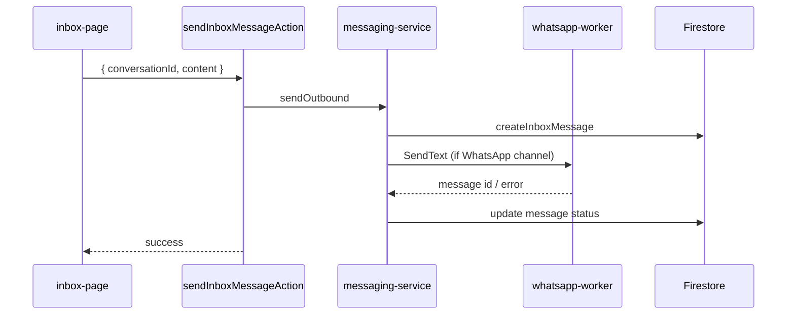
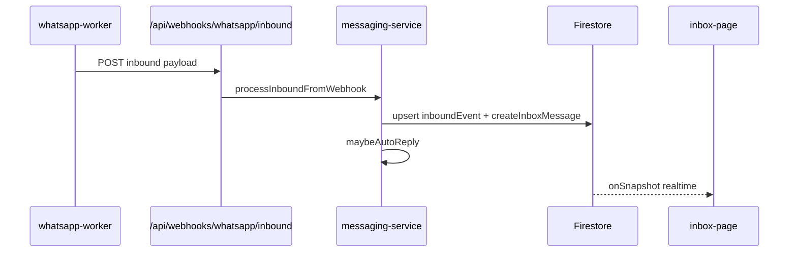

# 11 — Inbox and Messaging

## Purpose

Document conversation management, message lifecycle, real-time updates, and agent tooling in the inbox.

## Status

`partial` — Firestore CRUD, realtime listeners, and WhatsApp webhook delivery work when the linked session is `connected`. Re-pair required when session drops.

## Source of truth

- [components/inbox/inbox-page.tsx](../../components/inbox/inbox-page.tsx)
- [components/server-actions/inbox.ts](../../components/server-actions/inbox.ts)
- [lib/messaging/messaging-service.ts](../../lib/messaging/messaging-service.ts)
- [lib/firebase/services/inbox-service.ts](../../lib/firebase/services/inbox-service.ts)
- [hooks/use-inbox-realtime.ts](../../hooks/use-inbox-realtime.ts)
- [app/api/webhooks/whatsapp/inbound/route.ts](../../app/api/webhooks/whatsapp/inbound/route.ts)

## Data model hierarchy

```
InboxCustomer (1) ──→ (N) InboxConversation ──→ (N) InboxMessage
```

All records scoped under `companies/{companyId}/`.

Inbound events (retry queue): `companies/{companyId}/inboundEvents/{eventId}`

## UI features (inbox-page.tsx)

| Feature | Implementation |
|---------|----------------|
| Conversation list | `getInboxConversationsAction` |
| Conversation detail + messages | `getInboxConversationDetailAction` |
| Send message | `sendInboxMessageAction` → `sendOutbound` |
| Mark read | `markInboxConversationReadAction` |
| Update metadata | `updateInboxConversationMetadataAction` |
| AI suggestions | `getSuggestedResponsesAction` (Gemini) |
| Live agent panel | [context-panel.tsx](../../components/inbox/context-panel.tsx) |
| Real-time updates | Firestore `onSnapshot` via `useInboxRealtime` |
| WhatsApp repair banner | When no connected session or re-pair required |

## Message fields

| Field | Purpose |
|-------|---------|
| senderType | customer / agent / bot / system |
| senderUserId | Agent uid when senderType=agent |
| content | Message text |
| status | pending / sent / delivered / read / failed |
| sentAt | Timestamp |

## Send message flow



## Inbound message flow



Cron fallback: [app/api/cron/process-inbound-events/route.ts](../../app/api/cron/process-inbound-events/route.ts) retries pending events every 2 min.

## Auto-reply

When an AI agent has `autoReply: true`, is linked to the session, and the conversation is unassigned:

1. `generateAutoReplyText` (Gemini)
2. `sendOutbound` via WhatsApp worker

Blocked when: survey active, conversation assigned, agent disabled, or session not connected.

## WhatsApp session truth

`getInboxConnectionsAction` and `getWhatsAppSessionsAction` route through `WhatsAppOrchestrator.listSessions` → `enrichAndPersist` so UI reflects live worker status, not stale Firestore.

## Related specs

- [09-whatsapp-integration.md](09-whatsapp-integration.md)
- [23-whatsapp-inbound-reliability.md](23-whatsapp-inbound-reliability.md)
- [22-scheduled-jobs.md](22-scheduled-jobs.md)
