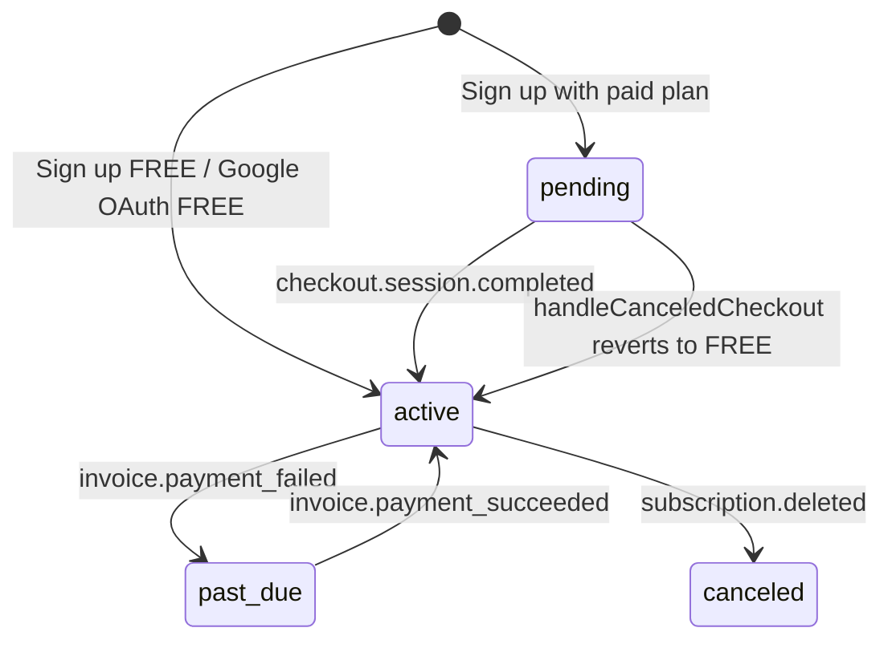

# 12 — Subscription and Billing

## Purpose

Document subscription plans, Stripe integration, usage tracking, and billing lifecycle.

## Status

`implemented` — Stripe flows work with Firestore-backed subscriptions.

## Source of truth

- [components/server-actions/subscription.ts](../../components/server-actions/subscription.ts)
- [components/server-actions/auth.ts](../../components/server-actions/auth.ts) — checkout on sign-up
- [lib/stripe.ts](../../lib/stripe.ts), [lib/stripe-service.ts](../../lib/stripe-service.ts)
- [lib/firebase/services/subscription-service.ts](../../lib/firebase/services/subscription-service.ts)
- [lib/services/subscription-validation.ts](../../lib/services/subscription-validation.ts)
- [app/api/stripe/webhook/route.ts](../../app/api/stripe/webhook/route.ts)
- [STRIPE_SETUP.md](../../STRIPE_SETUP.md)

## Plan types

Enum `PlanType`: `FREE`, `STARTER`, `PRO`, `BUSINESS`, `ENTERPRISE`

Plans defined in code (`PLAN_DEFINITIONS` in subscription-service) with Stripe price IDs from env vars. Stored at `companies/{id}/subscription/current`.

## Subscription lifecycle

### CustomerSubscription fields (Firestore)

- `status`: SubscriptionStatus enum
- `billingInterval`: monthly | yearly
- `stripeCustomerId`, `stripeSubscriptionId`
- `currentPeriodStart`, `currentPeriodEnd`
- `cancelAtPeriodEnd`, trial dates
- `planId` → linked plan definition

## Stripe integration

### Client

[`lib/stripe-client.ts`](../../lib/stripe-client.ts) — `NEXT_PUBLIC_STRIPE_PUBLISHABLE_KEY`

### Server

[`lib/stripe-service.ts`](../../lib/stripe-service.ts):

- `createCheckoutSession` — plan upgrade with success/cancel URLs
- `createPortalSession` — billing management
- Uses `NEXT_PUBLIC_APP_URL` for redirect URLs
- Checkout metadata includes `companyId`

### Webhook

See [08-api-routes.md](08-api-routes.md#apistripewebhook). Updates Firestore subscription docs.

## Plan feature flags

Defined per plan in `PLAN_DEFINITIONS` ([lib/plan-limits.ts](../../lib/plan-limits.ts) for AI limits):

| Flag / field | Purpose |
|--------------|---------|
| maxAiResponses | Monthly AI response limit (shown in subscription UI) |
| allowExport | Data export feature access |
| allowApiAccess | Company API token generation |
| removeBranding | Remove "Powered by botinho.ai" from automated replies |

Validated via [subscription-validation.ts](../../lib/services/subscription-validation.ts) (`validateApiAccess`).

## AI usage tracking

Tracked in Firestore and surfaced on the subscription page:

- Path: `companies/{id}/usage/{YYYY-MM}`
- Metric: `AI_RESPONSES`
- Limits per plan: [lib/plan-limits.ts](../../lib/plan-limits.ts)
- Service: [ai-usage-service.ts](../../lib/firebase/services/ai-usage-service.ts)

## Edge cases

- FREE plan created automatically on company creation.
- Pending subscription redirects owner to Stripe checkout on sign-in.
- Non-owner members cannot complete checkout for pending company subscription.
- Plan price IDs come from env vars — missing vars disable paid checkout for that tier.

## Open questions

None for as-is documentation.
