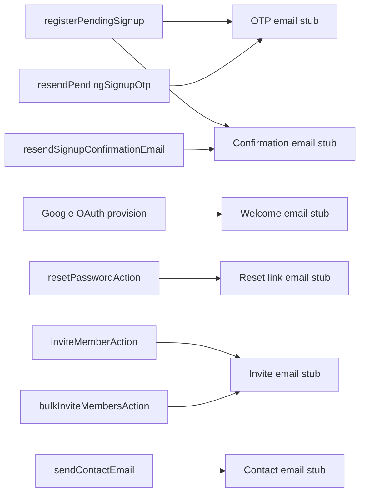

# 13 — Email System

## Purpose

Document transactional email templates, send triggers, and current provider status.

## Status

`stub` — No production email provider configured. Development mode logs emails to console.

## Source of truth

- [lib/email/send-transactional-email.ts](../../lib/email/send-transactional-email.ts)
- [lib/email/email-messages.ts](../../lib/email/email-messages.ts)
- Send calls in server actions and signup flow

## Provider

**None configured.** Previous providers removed:

| Provider | Status |
|----------|--------|
| Resend + React Email | Removed (no `emails/` folder, no `@react-email` deps) |
| Zavu email channel | Removed |

Current stub behavior ([send-transactional-email.ts](../../lib/email/send-transactional-email.ts)):

| Environment | Behavior |
|-------------|----------|
| `development` | `console.info("[email:dev-fallback]", { to, subject, text })` |
| `production` | `console.warn` — email not sent |

## Message builders

Plain-text templates in [email-messages.ts](../../lib/email/email-messages.ts):

| Builder | Subject (typical) | Trigger |
|---------|-------------------|---------|
| `buildWelcomeEmail` | Welcome to botinho.ai | Google OAuth new user |
| `buildEmailConfirmationEmail` | Confirm your email | Sign-up (non-OTP), resend |
| `buildCompanyInviteEmail` | Company invitation | inviteMemberAction, bulkInvite |
| Inline OTP text | Verification code | signUpAction (OTP), resendOTPAction |
| Inline reset text | Reset your password | resetPasswordAction |
| Inline contact text | Support form | sendContactEmail |

## Send trigger map



## Localization

Email subjects and body text vary by locale (`en` vs `pt-BR`) in send calls.

## Base URL resolution

Links in emails use:

```
NEXT_PUBLIC_APP_URL → HOST → http://localhost:3000
```

Confirmation/reset links include locale prefix and query tokens.

## Password reset

Uses Firebase Admin SDK `generatePasswordResetLink` — the link itself is Firebase-hosted; the app sends it via email stub.

## Data contracts

Contact form ([contact.ts](../../components/server-actions/contact.ts)):

- name, email, message (Zod validated)
- Sends to `SUPPORT_EMAIL` env var (default `hello@botinho.ai`)

## Edge cases

- Email send failures in production are silent (warn log only); user-facing flows still succeed.
- OTP codes are visible in dev console when `OTP_ENABLED=TRUE`.
- Production sign-up/invite emails will not reach users until a provider is configured.

## Next steps

See [future/03-messaging-and-email.md](future/03-messaging-and-email.md) for provider selection. Candidate options: Resend, SendGrid, AWS SES, or unified messaging API with email channel.

## Open questions

- Will email and WhatsApp use the same provider or separate services?
