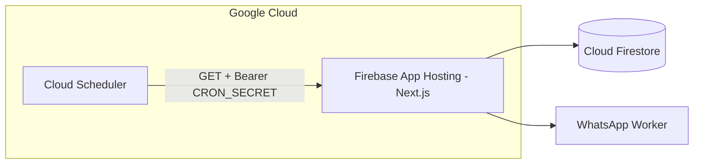

# 22 — Scheduled Jobs (Background Tasks)

## Purpose

Document HTTP cron endpoints for retry queues and campaign delivery. The app runs on **Firebase App Hosting / Google Cloud** — not Vercel. Schedules are configured with **Google Cloud Scheduler** (or manual calls in development).

## Status

`implemented` — Route handlers and auth exist; Cloud Scheduler jobs are configured per environment (not checked into repo).

## Source of truth

- [app/api/cron/](../../app/api/cron/)
- [lib/cron/auth.ts](../../lib/cron/auth.ts)
- [lib/campaign/campaign-delivery.ts](../../lib/campaign/campaign-delivery.ts)
- [lib/messaging/messaging-service.ts](../../lib/messaging/messaging-service.ts)

---

## Architecture



Campaign **launch** and **resume** also trigger an immediate delivery batch in-process (no scheduler wait). Cloud Scheduler handles retries, throttled campaign batches, and scheduled campaign start times.

---

## Endpoints

| Method | Path | Schedule (prod) | Purpose |
|--------|------|-----------------|---------|
| GET | `/api/cron/process-inbound-events` | Every 2 min | Retry pending/failed inbound events and auto-replies |
| GET | `/api/cron/process-outbound-pending` | Every 5 min | Retry pending/failed outbound WhatsApp messages |
| GET | `/api/cron/process-campaigns` | Every 2 min | Process running/scheduled campaigns (throttled batches) |

Handlers: [process-inbound-events/route.ts](../../app/api/cron/process-inbound-events/route.ts), [process-outbound-pending/route.ts](../../app/api/cron/process-outbound-pending/route.ts), [process-campaigns/route.ts](../../app/api/cron/process-campaigns/route.ts).

---

## Authentication

[`verifyCronRequest`](../../lib/cron/auth.ts) accepts:

| Header | Value |
|--------|-------|
| `Authorization` | `Bearer <CRON_SECRET>` |
| `x-cron-secret` | `<CRON_SECRET>` |

Set `CRON_SECRET` in App Hosting secrets / environment. In **development**, if `CRON_SECRET` is unset, cron routes allow unauthenticated access (`NODE_ENV=development` only).

---

## Google Cloud Scheduler setup

Replace `YOUR_APP_URL` with the Firebase App Hosting URL (e.g. `https://your-backend--project-id.us-central1.hosted.app`).

```bash
# Example — create jobs (run once per environment)
gcloud scheduler jobs create http process-inbound-events \
  --schedule="*/2 * * * *" \
  --uri="YOUR_APP_URL/api/cron/process-inbound-events" \
  --http-method=GET \
  --headers="Authorization=Bearer YOUR_CRON_SECRET"

gcloud scheduler jobs create http process-outbound-pending \
  --schedule="*/5 * * * *" \
  --uri="YOUR_APP_URL/api/cron/process-outbound-pending" \
  --http-method=GET \
  --headers="Authorization=Bearer YOUR_CRON_SECRET"

gcloud scheduler jobs create http process-campaigns \
  --schedule="*/2 * * * *" \
  --uri="YOUR_APP_URL/api/cron/process-campaigns" \
  --http-method=GET \
  --headers="Authorization=Bearer YOUR_CRON_SECRET"
```

Store `CRON_SECRET` in [Firebase App Hosting secrets](https://firebase.google.com/docs/app-hosting/configure#secret-parameters) via `apphosting.yaml` or the Firebase CLI — do not commit secrets.

---

## Local development

Cron does **not** run automatically in `npm run dev`. Options:

1. **Campaign launch/resume** — triggers an immediate batch (no scheduler needed for first messages).
2. **Manual trigger:**

```bash
curl -s -H "Authorization: Bearer $CRON_SECRET" \
  http://localhost:3000/api/cron/process-campaigns | jq
```

3. **Local cron** — point `cron` or systemd at the same URLs with `CRON_SECRET`.

---

## Removed / legacy

| Item | Notes |
|------|-------|
| `vercel.json` | Removed — was Vercel Cron config; not used on Firebase/Google Cloud |
| `/api/cron/monthly-usage-tracking` | Removed with Prisma era; usage tracked inline in Firestore |

---

## Related specs

- [08-api-routes.md](08-api-routes.md) — full API route catalog
- [17-deployment-and-ops.md](17-deployment-and-ops.md) — deployment platform
- [21-campaigns.md](21-campaigns.md) — campaign delivery
- [11-inbox-and-messaging.md](11-inbox-and-messaging.md) — messaging retries
