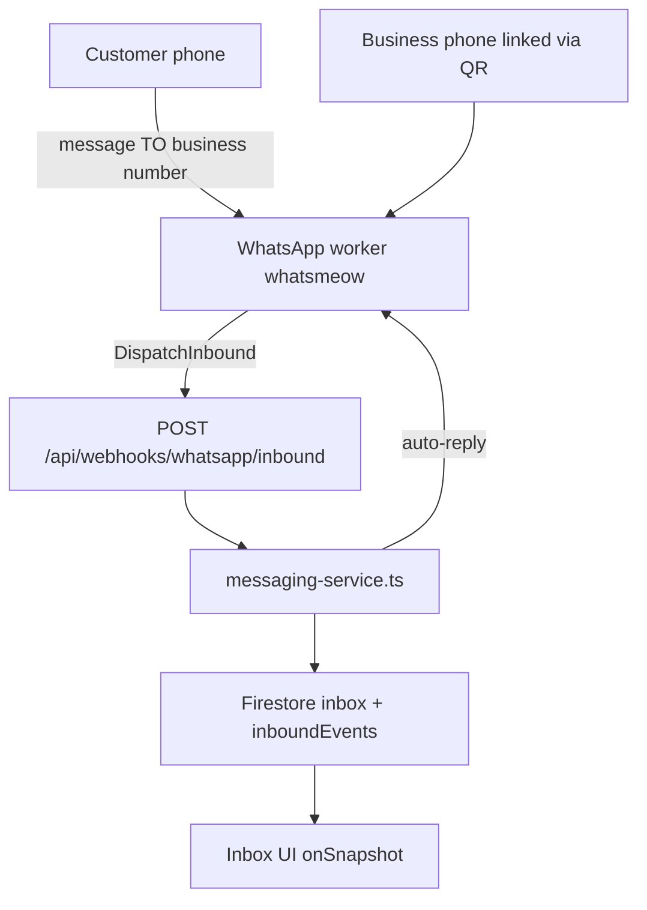
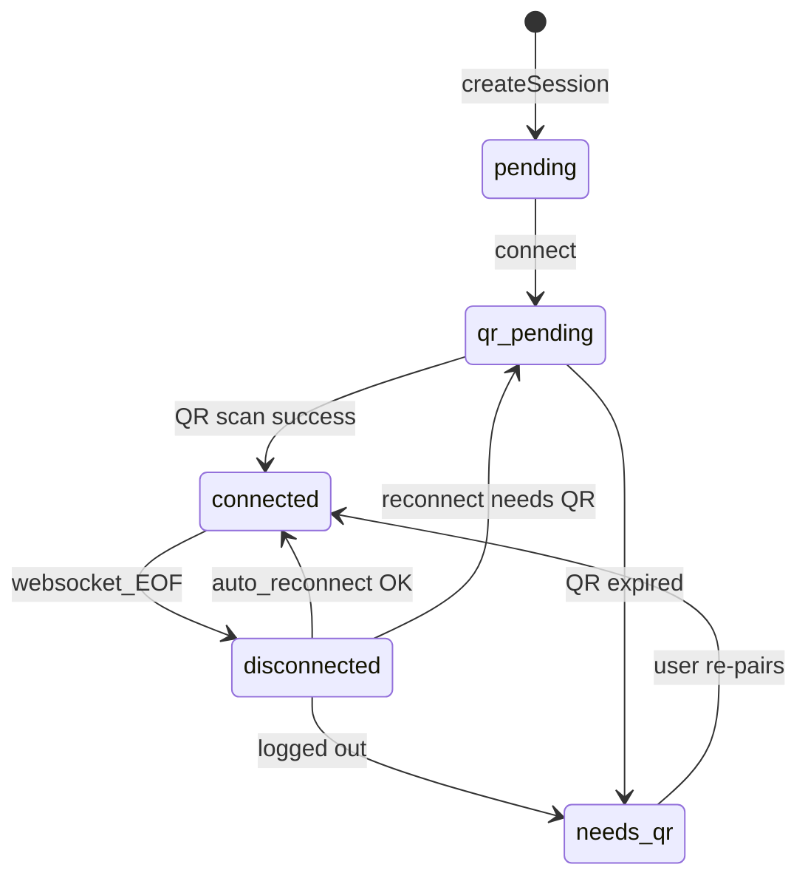

# 23 — WhatsApp Inbound Reliability

## Purpose

Document the end-to-end path from a customer WhatsApp message to inbox display and AI auto-reply, including session lifecycle, failure modes, recovery, and acceptance criteria for the whatsmeow linked-device architecture.

## Status

`partial` — Pipeline is implemented; linked-device sessions are fragile after websocket drops and require re-pairing or auto-recovery.

## Source of truth

- [services/whatsapp-worker/](../../services/whatsapp-worker/)
- [lib/whatsapp/](../../lib/whatsapp/)
- [lib/messaging/messaging-service.ts](../../lib/messaging/messaging-service.ts)
- [app/api/webhooks/whatsapp/inbound/route.ts](../../app/api/webhooks/whatsapp/inbound/route.ts)
- [components/settings/settings-page.tsx](../../components/settings/settings-page.tsx)
- [components/inbox/inbox-page.tsx](../../components/inbox/inbox-page.tsx)

---

## Components

| Component | Role |
|-----------|------|
| **WhatsApp worker** (Go + whatsmeow) | Hosts linked-device sessions; receives `events.Message`; POSTs inbound webhook |
| **Redis registry** | Worker discovery, session → worker assignment |
| **Orchestrator** (`lib/whatsapp/orchestrator.ts`) | Session CRUD, live status sync, outbound send |
| **Webhook** (`/api/webhooks/whatsapp/inbound`) | Auth + idempotent inbound processing |
| **Messaging service** | Dedupe, customer/conversation, inbox write, `maybeAutoReply` |
| **Cron** (`/api/cron/process-inbound-events`) | Retry pending inbound events and failed auto-replies |

---

## Architecture



---

## Session lifecycle

| Status | Meaning | Inbound received? |
|--------|---------|-------------------|
| `pending` | Session created, not connected | No |
| `qr_pending` | Awaiting QR scan or pairing in progress | No |
| `connected` | Logged in, websocket active | Yes |
| `disconnected` | Transient drop; reconnect attempted | No (until reconnected) |
| `needs_qr` | Credentials invalid; user must re-pair | No |



**Critical:** Inbound messages only flow when status is `connected` and whatsmeow is logged in. Outbound may briefly work with `IsConnected()` alone even when inbound is dead — do not use send success as health signal.

---

## Inbound data flow

1. whatsmeow `events.Message` (skip `IsFromMe`, groups)
2. Worker `OnMessage`: load session (`companyId`, `webhookUrl`); upsert `inboundEvents`; POST webhook
3. Next.js `processInboundFromWebhook` → `processInboundEvent`
4. Dedupe → customer → conversation → `createInboxMessage`
5. `maybeAutoReply` (async) if not survey/assigned/disabled
6. Firestore listeners → inbox UI refetch

---

## Inbound event schema

Path: `companies/{companyId}/inboundEvents/{eventId}`

| Field | Type | Notes |
|-------|------|-------|
| channel | string | `whatsapp` |
| sessionId | string | Worker session id |
| messageId | string | WhatsApp message id |
| from | string | Customer phone (digits) |
| to | string | Optional |
| body | string | Message text |
| phoneNumber | string | Business/session phone |
| status | string | `pending` / `processing` / `processed` / `failed` |
| autoReplyStatus | string | `sent` / `skipped` / `failed` |
| autoReplyReason | string | Skip/fail reason code |
| conversationId | string | Set after processing |
| inboxMessageId | string | Set after processing |

Event id format: `whatsapp_{sessionId}_{messageId}` (sanitized).

---

## Webhook contract

**URL:** `POST {WEBHOOK_APP_URL}/api/webhooks/whatsapp/inbound?companyId={id}&token={WHATSAPP_WEBHOOK_SECRET}`

**Auth:** Query param `token` must match `WHATSAPP_WEBHOOK_SECRET` (defaults to `WORKER_INTERNAL_TOKEN` in dev).

**Payload:**

```json
{
  "sessionId": "sess_...",
  "messageId": "...",
  "from": "5511981622360",
  "to": "5511971826688",
  "body": "hello",
  "type": "text",
  "timestamp": "2026-06-28T01:00:00Z",
  "eventId": "whatsapp_sess_..._msgid",
  "phoneNumber": "5511971826688"
}
```

**Responses:**

| Code | Meaning |
|------|---------|
| 200 | Processed or deduped |
| 400 | Invalid payload |
| 401 | Bad token |
| 503 | WhatsApp not configured |

**Docker dev:** Set `WEBHOOK_APP_URL=http://host.docker.internal:3000` so the worker container can reach Next.js.

**Idempotency:** Duplicate `eventId` upserts are skipped; processing is safe to retry.

---

## Processing guarantees

- **At-least-once:** Worker retries webhook 3 times; cron retries failed inbound events
- **Dedupe:** `messageDedupeRef(companyId, channel, messageId)` prevents duplicate inbox messages
- **Auto-reply:** Fire-and-forget after inbox write; failures recorded on inbound event

---

## Auto-reply preconditions

| Check | Skip reason |
|-------|-------------|
| Agent/company `autoReply` off | `auto_reply_disabled` |
| Conversation `assignedToId` set | `assigned_to_human` |
| Active survey | `survey_in_progress` |
| WhatsApp not configured | `whatsapp_not_configured` |
| Empty AI reply | `empty_reply` |
| WhatsApp delivery failed | `delivery_failed` |

Agent lookup: `getAiAgentBySessionId(companyId, sessionId)` — agent must have session in `sessionIds`.

---

## Failure modes

| Failure | Symptom | Mitigation |
|---------|---------|------------|
| Websocket EOF | Zero `[wa] message` logs | Auto-reconnect; user re-pair if `needs_qr` |
| Session `qr_pending` | No inbound | Settings re-pair banner |
| Firestore tag mismatch (Go) | Webhook skipped | Use `firestore` struct tags on worker models |
| `IsFromMe` | Business phone outbound ignored | Expected; test from external phone |
| LID / undecryptable | Logged, no inbox | `SenderAlt` resolution; whatsmeow updates |
| Wrong `WEBHOOK_APP_URL` | Worker can't POST | Docker env + `.env.example` |
| Stale UI status | Shows connected while dead | `enrichAndPersist` on all session reads |

---

## Recovery procedures

1. **Worker boot:** `recoverWorkerSessions` — start + connect sessions with `phoneNumber` and status `connected`/`disconnected`/`qr_pending`/`needs_qr`
2. **Periodic (30s):** Same recovery loop
3. **On disconnect:** Reconnect after 3s; set `needs_qr` if not logged in after attempt
4. **User re-pair:** Settings → WhatsApp → scan QR on business phone
5. **Cron:** `/api/cron/process-inbound-events` every 2 min

---

## Observability

| Log marker | Meaning |
|------------|---------|
| `[wa] message session=... fromMe=false` | Inbound received |
| `[wa] undecryptable message` | Decryption failed |
| `[wa] disconnected session=...` | Session dropped |
| `[wa] connected session=...` | Session live |
| `[worker] dispatching inbound webhook` | Webhook POST started |
| `[worker] ensuring session` | Recovery/reconnect |

**Health:** `GET /health` — worker ok + session count. Per-session status via worker internal API.

---

## Acceptance criteria

1. External phone message to linked business number appears in inbox within **5 seconds** when session `connected`
2. AI auto-reply delivered when agent enabled, session linked, conversation unassigned
3. Settings/inbox show **live** session status matching worker
4. When session drops: re-pair banner within **10 seconds**; no silent failure
5. Worker restart restores session without QR when store snapshot or Postgres credentials valid ([24-whatsapp-session-store-persistence.md](24-whatsapp-session-store-persistence.md))
6. Worker logs `[wa] message` for each real inbound test message

---

## Environment variables

| Variable | Purpose |
|----------|---------|
| `REDIS_URL` | Worker registry |
| `WORKER_INTERNAL_TOKEN` | Worker API auth |
| `WHATSAPP_WEBHOOK_SECRET` | Inbound webhook token |
| `WEBHOOK_APP_URL` | URL worker uses to POST webhooks |
| `NEXT_PUBLIC_APP_URL` | Browser-facing app URL |
| `FIRESTORE_PROJECT_ID` | Worker Firestore (Docker) |
| `GEMINI_API_KEY` | Auto-reply text generation |

Local dev: `npm run dev:infra` (Redis + worker) + `npm run dev` (Next.js).

---

## Open questions

- Migrate to Meta Cloud API for production stability vs linked-device limits?
- Consolidate worker + Next.js inbound event writes into single queue?
- Alerting (PagerDuty/Slack) on session `needs_qr` in production?
