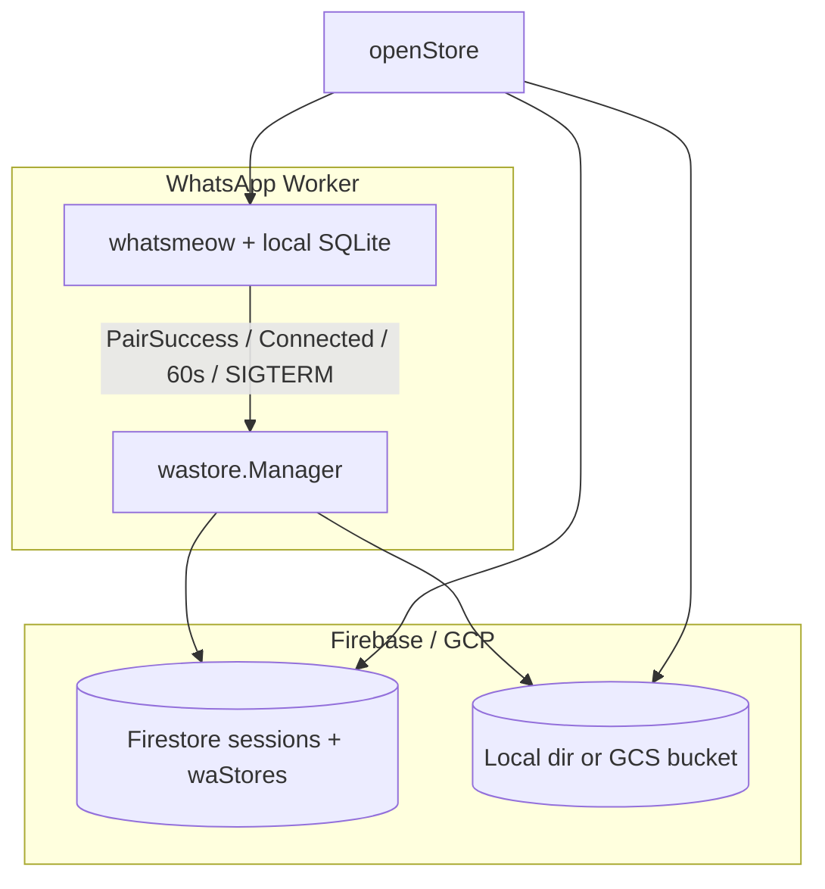

# 24 — WhatsApp Session Store Persistence (whatsmeow credentials)

## Purpose

Persist **whatsmeow pairing keys and session crypto state** so a worker can restart, scale, or be replaced **without requiring QR re-pair**, when WhatsApp has not invalidated the linked device.

## Status

`partial` — **Phase 1 implemented** with lifecycle gate (spec 25). SQLite snapshot + Firestore metadata + local/GCS backends. Phase 2 (shared Postgres) not started.

## Related specs

- [09-whatsapp-integration.md](09-whatsapp-integration.md)
- [23-whatsapp-inbound-reliability.md](23-whatsapp-inbound-reliability.md)
- [25-whatsapp-pairing-lifecycle.md](25-whatsapp-pairing-lifecycle.md)
- [services/whatsapp-worker/docs/GCP_DEPLOYMENT.md](../../services/whatsapp-worker/docs/GCP_DEPLOYMENT.md)

---

## Source of truth (session assignment)

| Layer | Role | Survives Redis down? |
|-------|------|----------------------|
| **Firestore `sessions`** | Canonical registry: `sessionId`, `companyId`, **`workerId`**, `phoneNumber`, `status` | **Yes** |
| **Firestore `waStores/{sessionId}`** | Snapshot metadata: GCS/local path, `sha256`, `version` | **Yes** |
| **GCS or local backup dir** | Encrypted/plain SQLite blob | **Yes** |
| **Redis** | Fast routing: `sessionId → workerId`, worker heartbeats, capacity | **No** |

**Worker restore scope:** On boot/recovery, the worker lists Firestore `sessions` where `workerId == thisWorker`, then for each `sessionId` restores from `waStores` if local SQLite is missing. It does **not** scan the entire bucket.

**Next.js when Redis is down:** Orchestrator falls back to `sessions.workerId` + `WORKER_BASE_URL:8081` (local dev) via `workerUrlFallback()`.

---

## Phase 1 implementation (current)

### Architecture

### Firestore `waStores/{sessionId}`

| Field | Type | Notes |
|-------|------|-------|
| sessionId | string | Document id |
| companyId | string | Optional audit |
| workerId | string | Last writer |
| storageProvider | string | `local` or `gcs` |
| objectPath | string | File path or `gs://…` key |
| version | number | Monotonic |
| sha256 | string | Plaintext db hash |
| sizeBytes | number | |
| updatedAt | timestamp | |

### Snapshot triggers

| Event | Action |
|-------|--------|
| `PairSuccess` / `Connected` (logged in) | **Sync** snapshot required before Firestore `connected` (see spec 25) |
| Every `WA_STORE_SNAPSHOT_INTERVAL` (default 60s) | Snapshot all logged-in sessions |
| `SIGTERM` / worker shutdown | `SnapshotAll` before exit |
| Session DELETE (user disconnect) | **Purge** local + remote store |

### Restore

On `openStore(sessionId)` when `SESSION_STORE_DIR` is set:

1. Read `waStores/{sessionId}`
2. If local `{sessionId}.db` SHA matches metadata → skip
3. Else download blob → verify SHA → write SQLite file
4. Open with `sqlstore.New`

### Backends

| `WA_STORE_BACKEND` | Storage | Use case |
|--------------------|---------|----------|
| `local` (default) | `WA_STORE_LOCAL_DIR/{sessionId}/v{n}.db` | Docker dev (`whatsapp-store-backups` volume) |
| `gcs` | `gs://{WA_STORE_BUCKET}/wa-session-stores/{sessionId}/v{n}.db` | Production |

### Code locations

| Component | Path |
|-----------|------|
| Snapshot manager | [services/whatsapp-worker/internal/wastore/](../../services/whatsapp-worker/internal/wastore/) |
| Pool integration | [services/whatsapp-worker/internal/wa/pool.go](../../services/whatsapp-worker/internal/wa/pool.go) |
| Firestore metadata | [services/whatsapp-worker/internal/repository/firestore.go](../../services/whatsapp-worker/internal/repository/firestore.go) |
| Worker boot | [services/whatsapp-worker/cmd/worker/main.go](../../services/whatsapp-worker/cmd/worker/main.go) |
| Orchestrator Redis fallback | [lib/whatsapp/orchestrator.ts](../../lib/whatsapp/orchestrator.ts) |

### Environment variables

| Variable | Default | Purpose |
|----------|---------|---------|
| `SESSION_STORE_DIR` | (memory) | Live whatsmeow SQLite directory |
| `WA_STORE_BACKEND` | `local` | `local` or `gcs` |
| `WA_STORE_LOCAL_DIR` | `/data/wa-store-backups` | Local snapshot root |
| `WA_STORE_BUCKET` | — | Required when `backend=gcs` |
| `WA_STORE_SNAPSHOT_INTERVAL` | `60s` | Periodic snapshot |
| `WA_STORE_RETAIN_VERSIONS` | `3` | Local backend pruning |

---

## Phase 2 (planned): Shared Postgres

Point whatsmeow at Cloud SQL Postgres via `sqlstore.New(ctx, "postgres", dsn, log)` — no file snapshot loop. See options analysis below.

---

## Problem (historical)

| Before Phase 1 | Result |
|----------------|--------|
| whatsmeow store = SQLite on worker volume only | Lost on pod/volume loss |
| Firestore `waStores` stub (`checkpoint-v1`) | Never restored |
| `LoadCheckpoint` never called | |

---

## Options evaluated

### A. SQLite snapshot → GCS/local — **implemented (Phase 1)**

### B. Shared Postgres — **planned (Phase 2)**

### C. Firestore-native custom store — **not recommended**

### D. Firestore blob only — **not recommended** (1 MiB doc limit)

### E. Firestore managed export/import — **not applicable**

---

## Security

- SQLite files contain **password-equivalent** key material
- GCS: use bucket IAM + default encryption; add KMS in production hardening
- Firestore `waStores`: worker service account only; deny client SDK access
- Never log snapshot contents

---

## Acceptance criteria (Phase 1)

1. After pairing, `waStores/{sessionId}` has `objectPath`, `sha256`, `version`
2. Delete local `{sessionId}.db`, restart worker → restore → `hasCredentials: true` without QR
3. User disconnect (DELETE session) purges local + backup + `waStores`
4. Worker lists only Firestore sessions with matching `workerId` — no full-bucket import
5. Orchestrator reaches worker via Firestore `workerId` fallback when Redis is unavailable (local dev)

---

## Open questions

1. KMS envelope encryption for GCS blobs in production?
2. Phase 2 Postgres: one schema per session vs shared tables?
3. Firestore `workers/{workerId}` collection for multi-worker URL registry without Redis?
