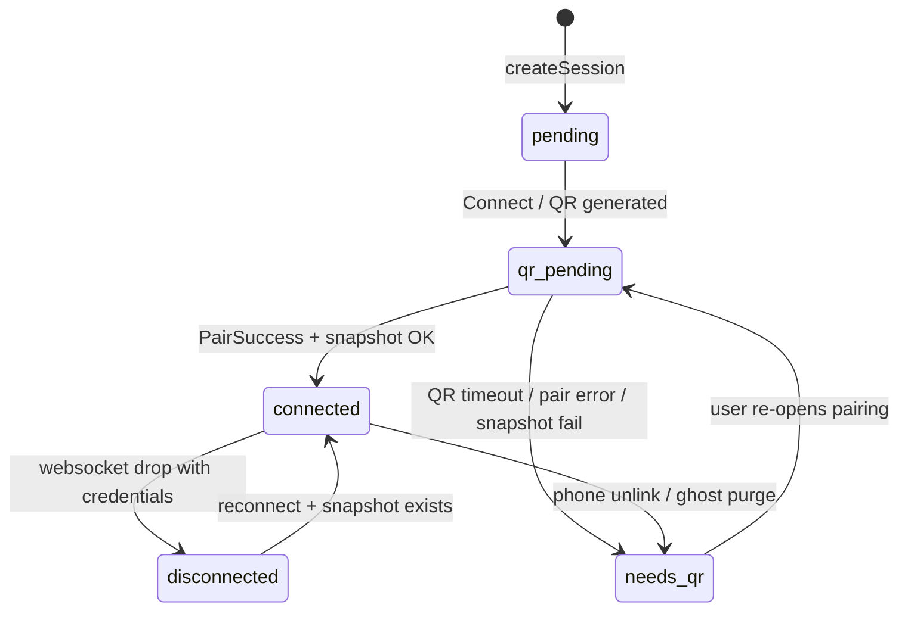

# 25 — WhatsApp Pairing Lifecycle & Session Sync Contract

## Purpose

Define a single, reliable contract for WhatsApp linked-device pairing so `sessions.status=connected` in Firestore **always** implies a durable whatsmeow credential snapshot exists and the worker can send/receive messages.

## Status

`implemented` — lifecycle gate, recovery rewrite, orchestrator sync (2026-06).

## Related specs

- [09-whatsapp-integration.md](09-whatsapp-integration.md)
- [24-whatsapp-session-store-persistence.md](24-whatsapp-session-store-persistence.md)
- [23-whatsapp-inbound-reliability.md](23-whatsapp-inbound-reliability.md)

---

## Problem (historical)

| Symptom | Root cause |
|---------|------------|
| Firestore `connected` but no `waStores` doc | Worker wrote `connected` before snapshot succeeded |
| Recovery loop every ~30s | Downgrade cleared Firestore but not local SQLite; app re-promoted via polling |
| Phone shows linked device, inbox fails | Phone UI ≠ worker `PairSuccess` + snapshot |
| `local` backend same error as `gcs` | Lifecycle bug, not storage backend |

---

## Source of truth layers

| Layer | Role | Authoritative for |
|-------|------|-----------------|
| Worker in-memory pool | Runtime whatsmeow client | Live QR, login, send/receive |
| Local SQLite (`SESSION_STORE_DIR`) | Active credential store | Current worker session |
| Firestore `waStores/{sessionId}` | Snapshot metadata | Restore after restart |
| GCS / local backup blob | Durable SQLite copy | Cross-restart / cross-pod |
| Firestore `sessions` | UI + routing metadata | **Cache only** — must match worker + waStores |

---

## Invariants

1. **`connected` ⇒ `waStores` exists** (when `SESSION_STORE_DIR` is set and store enabled)
2. **`waStores` ⇒ blob exists** with matching `sha256`
3. **Downgrade / delete / ghost purge ⇒ purge** local SQLite + backup blob + `waStores` + phone index
4. **App never writes `connected`** unless worker reports `loggedIn=true` and `hasSnapshot=true`
5. **Worker never writes `connected` to Firestore** until `SnapshotSessionRequired` succeeds

---

## State machine



| Status | Meaning |
|--------|---------|
| `pending` | Session created, worker not connected |
| `qr_pending` | QR available or pairing in progress |
| `connected` | Logged in **and** snapshot persisted |
| `disconnected` | Websocket down; credentials + snapshot exist; reconnect attempted |
| `needs_qr` | No valid credentials or snapshot; user must re-pair |

---

## Pairing flow (correct)

1. App `createSession` → Firestore `pending` → worker `Start`
2. App `connectSession` / `getQrCode` → worker `Connect` → Firestore `qr_pending` + QR
3. User scans QR → worker `PairSuccess`
4. Worker **`SnapshotSessionRequired`** → GCS/local blob + Firestore `waStores`
5. Worker sets in-memory `connected` → **`syncSession`** → Firestore `connected` + phone
6. App poll sees `loggedIn=true`, `hasSnapshot=true` → UI shows connected

On snapshot failure at step 4: worker **`failPairingWithPurge`** → `needs_qr`, no Firestore `connected`.

---

## Recovery algorithm (worker boot + 30s ticker)

For each Firestore session with `workerId == thisWorker`:

| Firestore status | waStores | In pool | Action |
|------------------|----------|---------|--------|
| `qr_pending` / `needs_qr` / `pending` | — | — | Skip |
| `connected` | yes | — | `ensureWorkerSession` (Start + Connect) |
| `connected` | no | yes, logged in | Retry snapshot, sync |
| `connected` | no | yes, pairing | Sync metadata only |
| `connected` | no | no | **Ghost purge** (Stop purge=true + needs_qr) |
| `disconnected` | no | — | Skip |
| `disconnected` | yes | — | `ensureWorkerSession` |

---

## App orchestrator rules

- **`enrichAndPersist`**: never persist `connected` without `live.loggedIn && live.hasSnapshot`
- **`getQrCode`**: re-read Firestore after connect (no stale base)
- **`createSession`**: block if another session is `pending` / `qr_pending` / `needs_qr`
- **`deleteSession`**: stop worker first (purge=true), then delete Firestore
- **Settings list poll**: enrich only — do not auto-start sessions

---

## Worker status API

`GET /internal/sessions/{id}/status` returns:

| Field | Type | Notes |
|-------|------|-------|
| `status` | string | Sanitized — never `connected` without snapshot |
| `phoneNumber` | string | Only when logged in |
| `loggedIn` | bool | whatsmeow `IsLoggedIn()` |
| `hasCredentials` | bool | Store has device ID |
| `hasSnapshot` | bool | Firestore `waStores` doc exists |

---

## Environment

| Variable | Dev default | Prod |
|----------|-------------|------|
| `WA_STORE_BACKEND` | `local` | `gcs` |
| `SESSION_STORE_DIR` | `/data/sessions` | writable path |
| `WA_STORE_BUCKET` | — | Firebase Storage bucket |

---

## Acceptance criteria

1. Pair → logs: `[wa] qr code` → `[wa] pair success` → `[wastore] snapshot` → `[wa] session connected`
2. Firestore `waStores/{sessionId}` exists before `sessions.status=connected`
3. No repeated ghost downgrade loop while pairing dialog is open
4. `docker compose restart whatsapp-worker` → session restores without QR
5. Disconnect → `[wa] stop session=… purge=true` + session removed from Settings
6. Ghost session (connected, no waStores, not in pool) → one-time purge, no oscillation

---

## Ghost worker (WSL / Docker)

On WSL2, removing a container without `docker compose down --remove-orphans` can leave:

- Orphan `/app/worker` processes
- Stale `docker-proxy` still bound to an old container IP (often port **8081**)

Symptoms: app hits the wrong worker (`/health` returns `{"sessions":N,"status":"ok"}` **without** `details`), QR scans do nothing, Docker logs show no HTTP activity.

**Prevention**

| Measure | Location |
|---------|----------|
| Dev worker on port **8082** | `WHATSAPP_WORKER_PORT`, `docker-compose.dev.yml` |
| `--remove-orphans` on compose up/down | `package.json` `dev:infra*` |
| Health probe requires `details` | `lib/whatsapp/worker-client.ts` |
| Doctor script | `npm run dev:worker:doctor` → `scripts/whatsapp-worker-doctor.sh` |

**Cleanup**

```bash
npm run dev:worker:doctor
```

If port 8081 still responds without `details`, restart the Docker daemon (Docker Desktop → Restart).

---

## Code locations

| Component | Path |
|-----------|------|
| Pairing gate | `services/whatsapp-worker/internal/wa/pool.go` — `promoteConnectedAfterSnapshot`, `sanitizeSyncModel` |
| Recovery | `services/whatsapp-worker/cmd/worker/main.go` — `recoverWorkerSessions` |
| Snapshot | `services/whatsapp-worker/internal/wastore/manager.go` |
| Orchestrator | `lib/whatsapp/orchestrator.ts` — `isFullyConnected`, `enrichAndPersist` |
