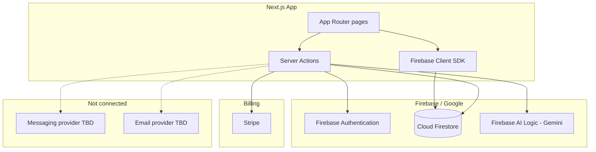

# Roadmap — Remaining Work

## Purpose

Track what is **done** vs **still open** after the Firebase + Gemini migration. The as-is specs under `docs/spec/` describe current behavior.

## Status

`open` — messaging and production email are the main blockers.

## Completed migrations

| Area | From | To | Spec |
|------|------|-----|------|
| Data layer | Prisma + PostgreSQL | Cloud Firestore | [01-firebase-platform.md](01-firebase-platform.md) ✅ |
| Authentication | NextAuth-only credentials | Firebase Auth + NextAuth JWT bridge | [01-firebase-platform.md](01-firebase-platform.md) ✅ |
| AI inference | Rule-based suggestions | Gemini via Firebase AI Logic | [02-gemini-ai.md](02-gemini-ai.md) ✅ |
| Real-time inbox | Custom WebSocket | Firestore `onSnapshot` listeners | [11-inbox-and-messaging.md](../11-inbox-and-messaging.md) ✅ |
| Email (dev) | Resend | Console stub | [13-email-system.md](../13-email-system.md) ⚠️ stub |
| WhatsApp | Custom controller / Zavu | Removed — TBD | [09-whatsapp-integration.md](../09-whatsapp-integration.md) ⚠️ stub |
| Opineeo legacy | Survey branding, stale config | botinho.ai stack | [18-known-gaps-and-legacy.md](../18-known-gaps-and-legacy.md) ✅ |

## Current architecture

## Open work

### 1. Messaging + email provider (blocking)

See [03-messaging-and-email.md](03-messaging-and-email.md).

Requirements:

- WhatsApp Business send/receive
- Transactional email (OTP, invites, password reset, contact form)
- Inbound webhook route
- Delivery status correlation on inbox messages
- Optional SMS fallback per company

**Decision status:** Provider not chosen. Zavu was evaluated and removed.

### 2. Production hardening

| Item | Priority |
|------|----------|
| Firestore security rules | High |
| Production email delivery | High (blocks sign-up in prod) |
| Firebase App Hosting migration | Medium |
| CI/CD + tests | Medium |

### 3. Feature completion

| Feature | Depends on |
|---------|------------|
| Auto-reply send | Messaging provider |
| Customer CRM page | Firestore customers collection (data exists) |
| Dashboard live KPIs | Inbox + messaging data |

## What stays the same

| Area | Decision |
|------|----------|
| **Stripe** | Keep for subscription billing |
| **Next.js 15 App Router** | Keep |
| **Firebase + Gemini** | Keep |
| **NextAuth JWT bridge** | Keep until full Firebase session cookie migration |
| **Multi-tenancy** | Company-scoped Firestore paths |

## Related ADRs

| ADR | Title | Status |
|-----|-------|--------|
| [0001-firebase-google-stack.md](../../adr/0001-firebase-google-stack.md) | Adopt Firebase + Gemini; messaging TBD | accepted (updated) |

## Spec update workflow

When implementing remaining work:

1. Choose messaging/email provider → update [03-messaging-and-email.md](03-messaging-and-email.md)
2. Add ADR if irreversible
3. Update as-is specs (09, 11, 13, 16) and feature matrix in [01-product-overview.md](../01-product-overview.md)
